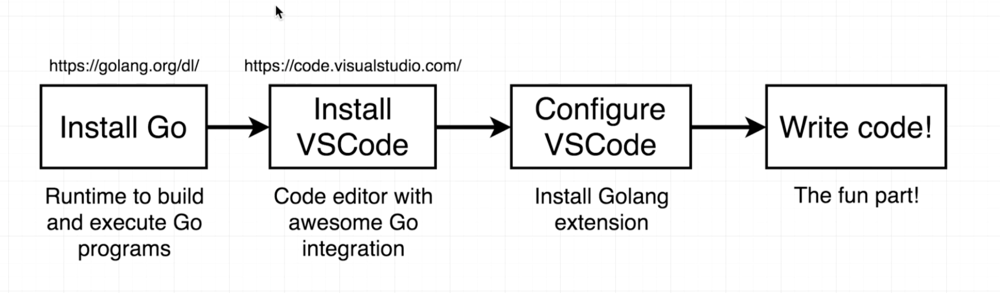
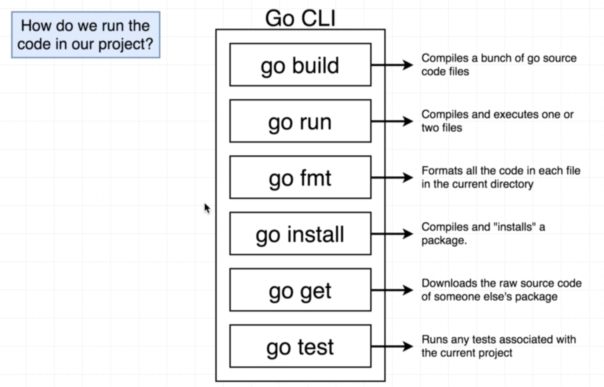
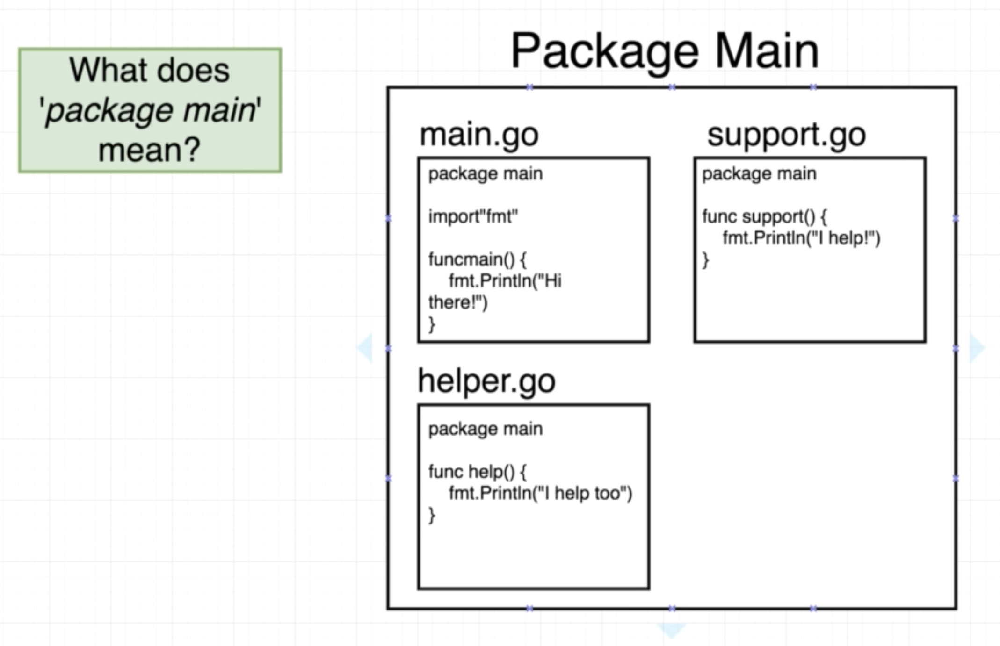
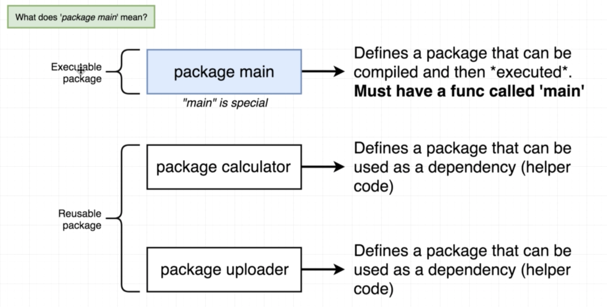

# Summary of Go: The Complete Developer's Guide (Golang)
Summary of GO The Complete Developer's Guide (Golang) by Stephen Grider. The goal of this course :
- Build massively concurrent programs with Go Routines and Channels
- Learn the advanced features of Go
- Understand the differences between commonly used data structures
- Prove your knowledge with dozens of included quiz questions
- Apply Interfaces to dramatically simplify complex programs
- Use types to future-proof your code and reduce the difficulty of refactors

# A simple start

## How to run code in project

## Package
> Package == Project == Workspace

Type of packages :
- Executable (Generates a file that we can run)
- Reusable (Code used as `helpers`. Good place to used reusable logic)

